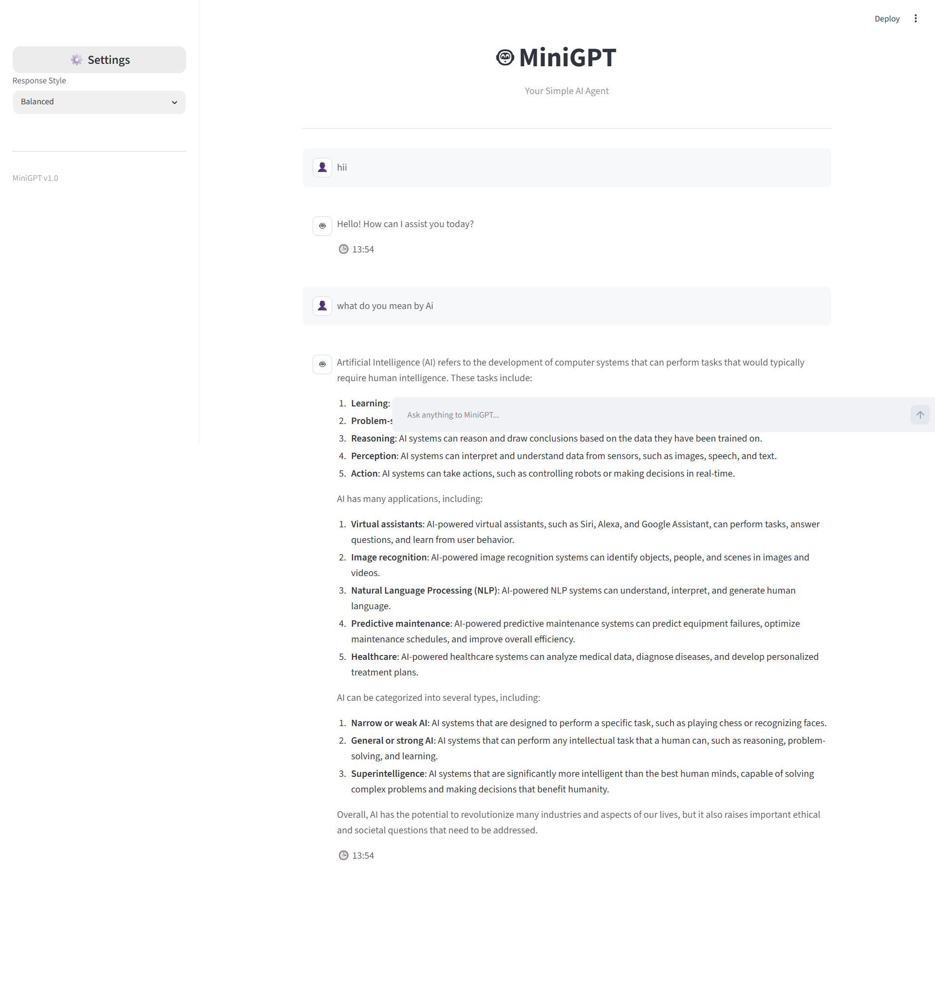

🤖 MiniGPT Agent

A lightweight tool-augmented AI assistant built with FastAPI, Streamlit, and LLM integration (Grok API), featuring intent classification, tool routing, and memory support.

✨ Overview

MiniGPT Agent is an AI-powered assistant built using a tool-augmented LLM architecture. It performs intent classification to route user queries to specialized tools such as a calculator and web search, and then uses an LLM to generate context-aware responses.

It demonstrates modular AI agent design with:

Tool usage

Memory system
API-based orchestration
Frontend + backend separation
🚀 Features
🧠 Intent Classification
Automatically detects query type (Math / Search / General)
🔎 Web Search Tool
Mock search system (extensible to real APIs like SerpAPI/Tavily)
🧮 Safe Calculator
Secure arithmetic evaluation using controlled logic
💬 LLM Integration
Uses Grok API for natural language responses
💾 Memory System
Stores chat history in JSON format
🌐 FastAPI Backend
Handles agent pipeline and tool routing
🎨 Streamlit Frontend
Clean chat-based UI for interaction


🧠 Architecture

User
  ↓
Streamlit UI
  ↓
FastAPI Backend
  ↓
Intent Classifier
  ↓
Tool Router
  ├── Calculator Tool
  ├── Web Search Tool
  └── LLM (Grok API)
  ↓
Memory Storage (JSON)
  ↓
Final Response


⚙️ Tech Stack

Python 🐍
FastAPI ⚡
Streamlit 🎨
Grok API / LLM 🤖
Pydantic 📦
Requests 🔗


📁 Project Structure

ai-agent-assistant/
│
├── app/
│   ├── __init__.py
│   ├── agent.py
│   ├── intent.py
│   ├── llm.py
│   ├── memory.py
│   └── tools/
│       ├── calculator.py
│       └── search.py
│
├── app_ui.py
├── main.py
├── requirements.txt
├── chat_memory.json
└── README.md


## ⚙️ Installation
### 1. Clone the Repository
```bash
git clone https://github.com/shakilathasneem9/minigpt-agent.git
cd minigpt-agent
```
2. Create Virtual Environment (optional but recommended)

Mac/Linux

```
python -m venv venv
source venv/bin/activate
```
Windows
```
python -m venv venv
venv\Scripts\activate
```
3. Install Dependencies
```
pip install -r requirements.txt
```
▶️ Running the Project

Start Backend (FastAPI)
```
uvicorn main:app --reload
```
Start Frontend (Streamlit)
```
streamlit run app_ui.py
```
screenshot


💡 Example Usage

Input:
What is 25 * 90?
Output:
2250

Input:
Tell me about Artificial Intelligence
Output:
AI is a field of computer science focused on creating systems that simulate human intelligence...


🧩 Key Concepts Demonstrated

Tool-augmented LLM architecture
Intent classification (rule-based routing)
Modular backend design
API communication between services
State persistence using JSON memory
Secure evaluation for math operations

⚠️ Notes

Calculator uses safe evaluation (no raw eval)
Memory is stored locally in JSON file
Grok API key required for LLM responses
👨‍💻 Author

shakila thasneem
AI/ML Enthusiast | Python Developer


⭐ If you like this project

Give it a star ⭐ and feel free to fork it!
<<<<<<< HEAD
=======

License

This project is created for educational and portfolio purposes.
>>>>>>> adab807 (Add MIT License)
